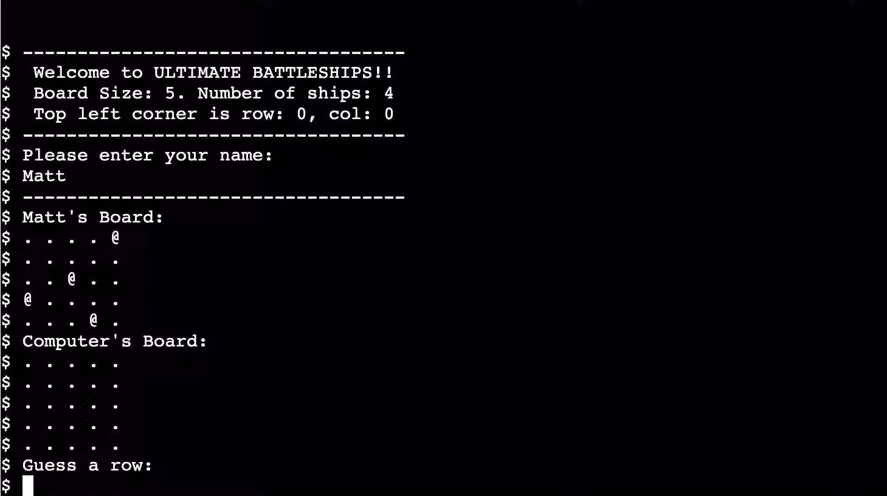
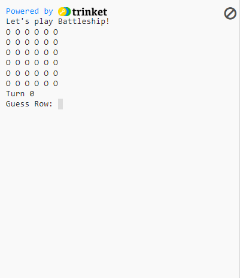
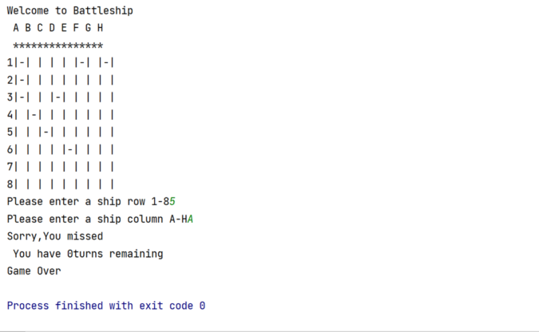
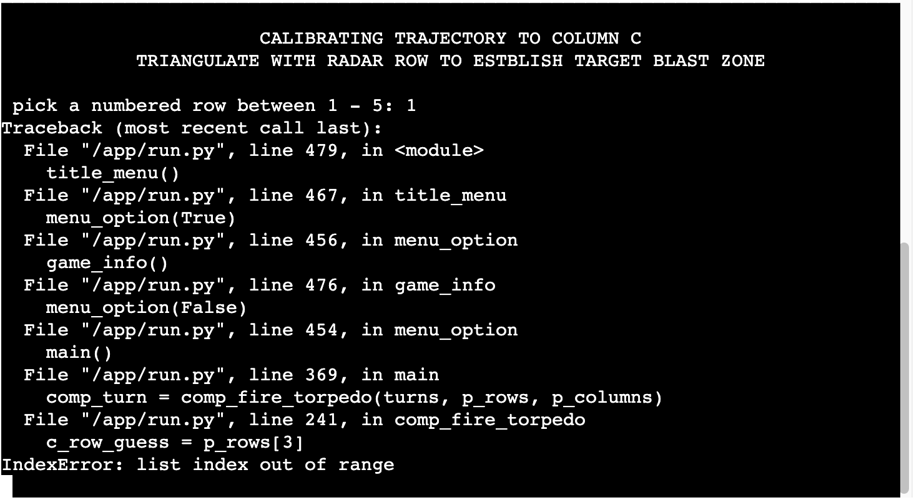
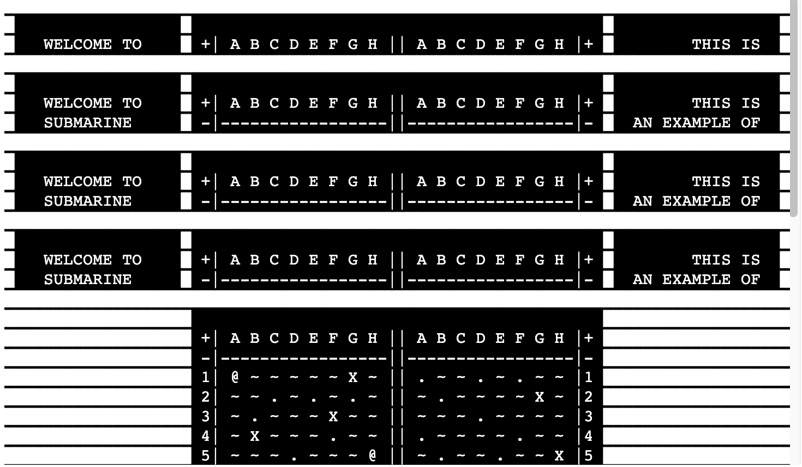
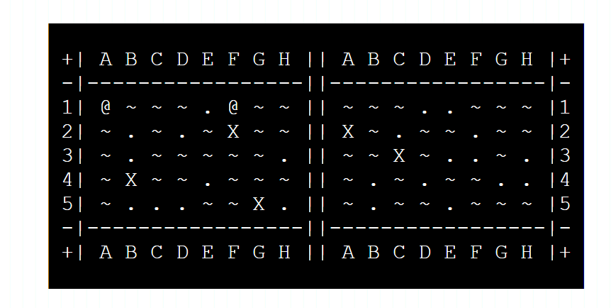
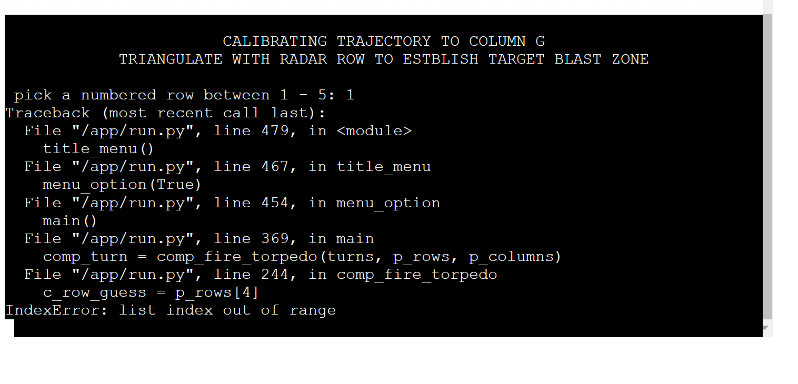

# QWETHT

[amiresponsive](#amiresponsive immage)

### The adventure game that goes beyond your wildest dreams. If your dreams were relatively unimaginative

---

## Table of Contents
1. [INTRODUCTION](#introduction)
2. [DESIGN](#design)
- [UX](#ux)
  - [Research](#research)
- [Development Planes](#development-planes)
  - [Strategy](#strategy)
  - [Scope](#scope)
  - [Structure](#structure) 
  - [Skeleton](#skeleton)
- [Colour Scheme](#colour-scheme)
- [Typography](#typography)
- [Imagery](#imagery)

3. [FEATURES](#features)
- [Design Features](#design-features)
- [Visual Features](#visual-features)
- [Gameplay + JS Features](#gameplay-features)
- [404 and 500 Features](#404-and-500-error-pages)
- [Features to Implement in Future](#features-to-implement-in-future)

4. [BUGS](#bugs)
- [Resolved Bugs](#resolved-bugs)
- [Unresolved Bugs](#unresolved-bugs)

5. [TECHNOLOGIES](#technologies)
- [Languages Used](#languages-used)
- [Frameworks](#frameworks--libraries--programs)
- [Libraries](#frameworks--libraries--programs)
- [Programs](#frameworks--libraries--programs)

6. [TESTING](testing.md)

Contained as a seperate document [here](testing.md)

7. [DEPLOYMENT](#deployment)

Step-by-step guide on how to deploy

8. [CREDITS](#credits)

9. [ACKNOWLEDGEMENTS](#acknolwedgments)

---

# Introduction

```
        ___________ _____ _____ _______    ____ _________ ______________
       /          //    //    //   _   \  /    \\    _   \\             \
      /          //    //    //   //   / /  /\  \\   \\   \\             \   
     /     _____//    //    //    '   / /  /  \  \\   \\   \\   \\   \\   \   
    /          //     '    //    _   | /  /   /  / \   \\   \\   \\   \\   \   
   /______    //          //    //   //  /___/  /   \   `    \\   \\   \\   \  
  /          //__________//_________//_________/     \________\\___\\   \\   \ 
 /          /  M   A   R   I   N   E ████ I   N   A   T   I   O   N  \   \\   \
/__________/ █████████████████████████████████████████████████████████\___\\___\

```

`S U B M A R I N E ██ D O M I N A T I O N`, is an iteration on a classic game of "Battleships", in a terminal using Python on the command line.

```

████████████████████████████████████████████████████████████████████████████████
█                 █                                          █                 █
█   WELCOME TO    █ +| A B C D E F G H || A B C D E F G H |+ █        THIS IS  █
█   SUBMARINE     █ -|-----------------||-----------------|- █  AN EXAMPLE OF  █
█   DOMINATION    █ 1| ~ @ ~ ~ @ ~ ~ ~ || ~ ~ X ~ ~ ~ ~ ~ |1 █  THE SIMULATED  █
█   SIMULATION    █ 2| ~ ~ ~ ~ ~ ~ @ ~ || ~ ~ ~ ~ ~ ~ ~ ~ |2 █          ARENA  █
█   COMMANDER     █ 3| ~ ~ ~ ~ ~ ~ ~ ~ || ~ ~ ~ ~ . ~ ~ ~ |3 █                 █
█                 █ 4| ~ ~ ~ X ~ ~ ~ ~ || ~ ~ ~ ~ ~ ~ ~ ~ |4 █    ENEMY SUBS   █
█ [LEFT] IS YOUR  █ 5| ~ . ~ ~ ~ ~ @ ~ || ~ ~ ~ ~ ~ ~ ~ ~ |5 █ARE HIDDEN[RIGHT]█
█      ZONE       █ -|-----------------||-----------------|- █ . = MISSED SHOT █
█ @ = YOUR SHIPS  █ +| A B C D E F G H || A B C D E F G H |+ █  X = SUNK SUB   █
█                 █                                          █                 █
████████████████████████████████████████████████████████████████████████████████

```

The idea to shift the characteristics of the game to be _submarines_ instead of _battleships_ due to the nature that the player can see board boards simoultaneously.

When the program begins to run, players are asked to position 5 Submarines on the board:

```

AT THE START OF THE GAME, YOU WILL BE ASKED TO POSITION 5 SUBS
              LIKE THIS:
                     pick a lettered column between A - H:
              THEN LIKE THIS:
                      pick a numbered row between 1 - 5:

```

Once all 5 submarines are positioned, the game employs the same function to guess the coordinates of the computer's hidden submarines (it also has 5 submarines).

once a player's /computer's submarines have all been targeted, the game is over and a win/loss message is generated, supplemented with the otpion to start a new game.

**This project is the third of the five projects to be created for the Diploma in Full Stack Software Development (Common Curriculum)**

Based on the Learning outcomes of the section of the Diploma, this project aims to:

1. Create an interactive game through a _"given algorithm as a computer program"_ that projects  
2. Run a game of ` S U B M A R I N E ██ D O M I N A T I O N ` by _"Adapting and combining algorithms"_ to solve the processes and problem solving operations generated by the game's programming
3. Utilise _"standard programming constructs: repetition, selection, functions, composition, modules, aggregated data (arrays, lists, etc.)"_ to effictively run the game
4. _"Explain what the given program does"_ in it's code through effective commenting and docstrings
5. Using the project creation process to _"Identify and repair coding errors in a program"_
6. Create a Project that uses _"library software for building a graphical user interface, or command-line interface, or web application, or mathematical software"_
7. create a project that _"implements a data model, application features and business logic"_ and utilises these to generate easily recognisable responses and outcomes for users/players.
8. Create a Project that is developed through a documented process _"through a version control system such as **GitHub©**"_
9. Be Deployed on **Heroku©**


---

# Design

## UX

### **Research**

This project was designed to be a Minimally Viable Project (MVP). Therefore it aligns as-close-as-possible to the design brief. Of course, as the code developed, personal flair was intertwined with core conepts. But the primary focus of the project (to meet the design brief) was constantly at the forefront of design during development.

the following sources were viewed for the conept of UI visual layout **ONLY**:

| [Code Institute Project brief video](https://www.youtube.com/embed/4sqtzZQpDJE) |
|--------------------------------------------------------------------------------- |
|  |

| [trinket.io](https://trinket.io/python/051179b6d3) | [copyassignment.com](https://copyassignment.com/battleship-game-code-in-python/) |
| ------------------------------------ | ------------------ |
|  |  |

The following points were picked up by comparing the visual elements of the following 3 sources:
- UI is very narrow and bunched together
- The constraints of the UI makes User interface very bland and cluttered
- The visual representation for the "computer" playing the game is limited

Taking this into account. When the code for this project is developed. there will be focus drawn to making the command-line messages and interface more _game-like_.
<br>
<br>
<br>

## **Development Planes**

## Structure Plane
<br>


### **User Stories**

The following user stories were created based off of the following design brief set out in The [Portfolio Project 3 Assessment Guide](https://learn.codeinstitute.net/courses/course-v1:CodeInstitute+PE_PAGPPF+2021_Q2/courseware/b3378fc1159e43e3b70916fdefdfae51/605f34e006594dc4ae19f5e60ec75e2e/2?activate_block_id=block-v1%3ACodeInstitute%2BPE_PAGPPF%2B2021_Q2%2Btype%40vertical%2Bblock%403db2c53014c24243a11d471769df21e7):

    The Battleships game is played on grids on which each player's fleet of battleships are marked. The locations of the fleets are concealed from the other player. Players call shots at the other player's ships, and the objective of the game is to destroy the opposing player's fleet.

    The application provides a working battleships game for a single user to play against the computer.

    Potential features to include:

      The ability for the user to set the grid size
      Warn the user if their guess is off-grid

      External user’s goal:
      The application user wants to play a logic game

The learning outcomes below hae also been taken as a point of reference for the project. sourced directly from The [Portfolio Project 3 Assessment Guide](https://learn.codeinstitute.net/courses/course-v1:CodeInstitute+PE_PAGPPF+2021_Q2/courseware/b3378fc1159e43e3b70916fdefdfae51/605f34e006594dc4ae19f5e60ec75e2e/2?activate_block_id=block-v1%3ACodeInstitute%2BPE_PAGPPF%2B2021_Q2%2Btype%40vertical%2Bblock%403db2c53014c24243a11d471769df21e7):

| Learning outcomes |
|-------------------|
|**LO1**	Implement a given algorithm as a computer program|
|**LO2**	Adapt and combine algorithms to solve a given problem|
|**LO3**	Adequately use standard programming constructs: repetition, selection, functions, composition, modules, aggregated data (arrays, lists, etc.)|
|**LO4**	Explain what a given program does|
|**LO5**	Identify and repair coding errors in a program|
|**LO6**	Use library software for building a graphical user interface, or command-line interface, or web application, or mathematical software|
|**LO7**	Implement a data model, application features and business logic to manage, query and manipulate data to meet given needs in a particular real-world domain.|
|**LO8**	Demonstrate and document the development process through a version control system such as GitHub|
|**L09**	Deploy a command-line application to a cloud-based platform|
<br>

After reviewing this information, the following user-stories were created:

1. _"As a user, i want to play a simple game of battleships"_
2. _"As a user, i want to play some kind of logic game"_
3. _"As a user, i want to be able to position my own ships to allow for own personal strategy"_
4. _"As a user, i want to play against a 'computer' player"_
5. _"As a user, i want to be able to make my own choices when trying to guess the position of enemy ships"_
6. _"As a user, i want to be notified if i accidentally pick the same coordinate twice"_
7. _"As a user, i want to be prompted if enter invalid coordinates"_ 
8. _"As a user, i want to feel like my choices matter against the 'computer' player, and that i won't win if i just select each coordinate in sequential order"_
<br>
<br>

### **Project Goals**

Based on the criteria outlined above, the following project goals have been divided into User Goals and Developer Goals. These have been listed below:

**User Goals:**
<br>
Based on the user stories, User goals are defined as:
- create a command line game that is easy to follow
- the UI must be readable and friendly within the given limitations
- Employ code that simulates players playing against a chellenging AI opponent
- Allow for elements of personal choice when positioning ships and targeting enemy ships
- have contingencies in place if a mistake is made during an input error
- not punish the user for not enetering EXACT coordinates information

**Developer Goals:**
<br>
Based on Project research and design brief, Developer Goals are defined as:
- Have a command line game deployed and playable on the internet via Heroku©
- Develop a version of the game _"Battleships"_ in the coding language: Python
- implement use of python libraries to enhance the UX of The terminal based game
- Make use of ASCII Art to add more of a visual element to the game
- create a program that only requires game narrative input from the user, no knowledge of working from a command line should be required to play the game.
<br>
<br>

## Scope Plane
<br>


Based on the results yielded from refining the design brief and research in the previous section, the following features will be developed for the project:

1. **Horizontal Game board and Center Aligned HUD design**
    - Given the terminal is wider than it is in height, the print statements for the game will be created to accomodate free lateral real estate in the terminal
2. **Classic Battleships Coordinates**
    - To elaborate on the focus of a user friendly feel, the coordinates used will be similar to that of the original _"Battleships"_, where players would target an area on the board by a letter and a number
3. **Game-like Narrative**
    - Flipping the concept of taking the terminal as a limitation to style and turning it into a style choice, create a narrative in the language of the interface to make the game mimic the style of gimmicky vintage war game
4. **Anticipated error handling on user input**
    - ensure that input field data isn't case sensetive
    - If invalid field data is parsed into the terminal, the programme can recognise how the data is invalid, notify the user, then let them retry inputting a value without crashing the programme or punishing the user
5. **Responsive Terminal**
    - The terminal will routinely clear and update game-state information, to prevent scrolling and simulate that of an interactive game
    - the gameboard in the terminal will update every time a turn or change has been made to the game board
6. **How to Play Section**
    - An option will be present at the start menu that will explian the rules of the game to the user
<br>
<br>

## Structure Plane
<br>

In Terms of web layout, the project is hosted entirely through the project template after being deployed to Heroku©

[Link to the template used to create the Repo for this project](https://github.com/Code-Institute-Org/python-essentials-template)
<br>

The page itself acts as an index, and has no further functionality as this is out-of-scope for this project

Regarding the terminal, the amount of `rows` was increased from `24` to `30` accomodate some additional descriptions within print statements and remove the need for scrolling.
<br>
<br>

## Skeleton & Design Planes
<br>

Due to the nature of this project, both of these planes have been merged.

As this project was to run entirely of of a terminal. Notepad on Windows was the optimal choice to create mockups define the structure for each section. Transcript lisfted directly from planning and quoted in codeblock below:

```

80 columns x 24 rows
https://ascii.co.uk/art/submarine
https://ascii.co.uk/art/explosiv
.
                                  |`-:_
         ,----....____            |    `+.
        (             ````----....|___   |            - (sub art by Shimrod)
         \     _                      ````----....____
          \    _)                                     ```---.._
           \                                                   \
         )`.\  )`.   )`.   )`.   )`.   )`.   )`.   )`.   )`.   )`.   )`.
       -'   `-'   `-'   `-'   `-'   `-'   `-'   `-'   `-'   `-'   `-'   `


████████████████████████████████████████████████████████████████████████████████
████   /          //    //    //   _   \  /    \\    _   \\             \   ████
███   /          //    //    //   //   / /  /\  \\   \\   \\             \   ███
██   /     _____//    //    //    '   / /  /  \  \\   \\   \\   \\   \\   \   ██
█   /          //     '    //    _   | /  /   /  / \   \\   \\   \\   \\   \   █
█  /______    //          //    //   //  /___/  /   \   `    \\   \\   \\   \  █
█ /          //__________//_________//_________/     \________\\___\\   \\   \ █
█/          /█ M   A   R   I   N   E ████ I   N   A   T   I   O   N █\   \\   \█
█__________/ █████████████████████████████████████████████████████████\___\\___█
████████████████████████████████████████████████████████████████████████████████
                                      ____
                              __,-~~/~    `---.
                            _/_,---(      ,    )
                        __ /        <    /   )  \___
         - ------===;;;'====------------------===;;;===----- -  -
                           \/  ~"~"~"~"~"~\~"~)~"/   Nuclear
                           (_ (   \  (     >    \)   Explosion
                            \_( _ <         >_>'     Mushroom
                               ~ `-i' ::>|--"        - by Bill March
                                   I;|.|.|
                                  <|i::|i|`.
                                 (` ^'"`-' ")
         ------------------------------------------------------------------

███████████████████ +| A B C D E F G H || A B C D E F G H |+ ███████████████████
███████████████████ -|-----------------||-----------------|- ███████████████████
███████████████████ 1| ~ ~ ~ ~ ~ ~ ~ ~ || ~ ~ ~ ~ ~ ~ ~ ~ |1 ███████████████████
███████████████████ 2| ~ ~ ~ ~ ~ ~ ~ ~ || ~ ~ ~ ~ ~ ~ ~ ~ |2 ███████████████████
███████████████████ 3| ~ ~ ~ ~ ~ ~ ~ ~ || ~ ~ ~ ~ ~ ~ ~ ~ |3 ███████████████████
███████████████████ 4| ~ ~ ~ ~ ~ ~ ~ ~ || ~ ~ ~ ~ ~ ~ ~ ~ |4 ███████████████████
███████████████████ 5| ~ ~ ~ ~ ~ ~ ~ ~ || ~ ~ ~ ~ ~ ~ ~ ~ |5 ███████████████████
███████████████████ -|-----------------||-----------------|- ███████████████████
███████████████████ +| A B C D E F G H || A B C D E F G H |+ ███████████████████


████████████████████████████████████████████████████████████████████████████████
█                 █                                          █                 █
█   WELCOME TO    █ +| A B C D E F G H || A B C D E F G H |+ █        THIS IS  █
█   SUBMARINE     █ -|-----------------||-----------------|- █  AN EXAMPLE OF  █
█   DOMINATION    █ 1| ~ @ ~ ~ @ ~ ~ ~ || ~ ~ X ~ ~ ~ ~ ~ |1 █  THE SIMULATED  █
█   SIMULATION    █ 2| ~ ~ ~ ~ ~ ~ @ ~ || ~ ~ ~ ~ ~ ~ ~ ~ |2 █          ARENA  █
█   COMMANDER     █ 3| ~ ~ ~ ~ ~ ~ ~ ~ || ~ ~ ~ ~ . ~ ~ ~ |3 █                 █
█                 █ 4| ~ ~ ~ X ~ ~ ~ ~ || ~ ~ ~ ~ ~ ~ ~ ~ |4 █    ENEMY SUBS   █
█ [LEFT] IS YOUR  █ 5| ~ . ~ ~ ~ ~ @ ~ || ~ ~ ~ ~ ~ ~ ~ ~ |5 █ARE HIDDEN[RIGHT]█
█      ZONE       █ -|-----------------||-----------------|- █ . = MISSED SHOT █
█ @ = YOUR SHIPS  █ +| A B C D E F G H || A B C D E F G H |+ █  X = SUNK SUB   █
█                 █                                          █                 █
████████████████████████████████████████████████████████████████████████████████
         AT THE START OF THE GAME, YOU WILL BE ASKED TO POSITION 5 SUBS
              LIKE THIS:
                     pick a lettered column between A - H:
              THEN LIKE THIS:
                      pick a numbered row between 1 - 5:
████████████████████████████████████████████████████████████████████████████████
      YOU WILL THEN USE THIS SAME PROCESS TO PREDICT ENEMY SUB PLACEMENT
    THE HIGHLY ADVANCED AI WILL IN-TURN ATTEMPT TO PREDICT YOUR HIDDEN SUBS
          SIMULATION STEPS REPEAT UNTIL ALL 5 ENEMY SUBS ARE DOMINATED
                      OR ENEMY DOMINATES ALL 5 OF YOUR SUBS
           +| N: New Game || I: How to Play || X: close simulation |+
pick a lettered option listed above: 

                    ---POSITION SUB NUMBER  1, COMMANDER---
                       DESIGNATE RADAR COLUMN, COMMANDER
 pick a lettered column between A - H: 
 pick a numbered row between 1 - 5: 

```
<br>

### **Colour Scheme**
<br>

As the Terminal is black, the `HTML` template used was appended with a style rule to change thepage background to black, to immerse with the style of the game and improve visual effect

### **Typography**

Typography generated and unedited by Terminal

### **Imagery**

As seen in the Notepad block above. Art was sketched out on the notepad manually. for more complex shapes, ASCII art was sourced from [ASCII.co.uk](https://ascii.co.uk).
Original artists are credited above as appropriate

when building the board, an active choice was made to characterise blank spaces on the board with `~`, as this effectively represent waves on a body of water.

`@` signs were employed as player subs, as it was the closest thing to imagine as a periscope sticking out of the water.

`.` was used for a miss, as it was to emphasise stillness in the water but be more identifiable than `-`

`X` was used to mark a hit on the board for both sides, as an `X` is synonymous with negative outcomes. Also, sinking a sub is a relatively negative thing (if you are on board).


---

# Features


# Bugs

known Bugs

resolved*

1. Since debugging, this error has not been replicated. it was suspected that; upon defeat by the computer, the program would not exit the `while loop` that ran the core gameplay loop, resulting in an error throwing when it was trying to run the `while loop` on values which no longer had a value as the game had been restarted:

| Joe Collins |
|---------------|
|`Just had a little play looks great but did encounter an error that kicked me out. I think the coordinate i hit to get this was C1. I have added  a screenshot of the IndexError this caused.`|

| screenshot 1 | Screenshot 2 | 
| -------- | -------- | 
|||
Joe Collins:

| Cheryl Phillips: |
| ---------------- |
|`G1 here... This was the state of play at the time:`|

| Screenshot 1 | Screenshot 2 |
| ------------ | ------------ |
| ||

After consultation with The project mentor (Seun Owonikoko), the above explanation was expected. at this stage, the bug has been removed by implementing a `break` of the `loop` upon `player_shipcount` decreasing to `0`


# Credits

resources for creating code:
 - https://wiki.python.org/
 - https://www.digitalocean.com/community/tutorials/python-remove-character-from-string
 - https://thispointer.com/python-how-to-get-last-n-characters-in-a-string/
 - https://www.askpython.com/python/string/remove-character-from-string-python
 - https://pythontutor.com/ 
 - https://bobbyhadz.com/blog/python-add-items-to-dictionary-in-loop#:~:text=If%20the%20key%20is%20already%20in%20the%20dictionary%2C%20we%20use,update()%20method
 - https://www.simplilearn.com/tutorials/python-tutorial/list-to-string-in-python#:~:text=To%20convert%20a%20list%20to%20a%20string%2C%20use%20Python%20List,and%20return%20it%20as%20output
 - https://www.w3schools.com/python/python_conditions.asp
 - https://stackoverflow.com/questions/4528982/convert-alphabet-letters-to-number-in-python
 - https://stackoverflow.com/questions/58086435/how-to-select-a-specific-returned-variable-from-a-number-of-returned-variable-in
 - https://www.scaler.com/topics/how-to-clear-screen-in-python/
 - https://www.folkstalk.com/2022/10/python-loop-certain-number-of-times-with-code-examples.html
 - https://www.w3schools.com/python/ref_random_randint.asp
 - https://www.freecodecamp.org/news/python-break-and-python-continue-how-to-skip-to-the-next-function/#:~:text=You%20can%20use%20the%20continue,move%20onto%20the%20next%20iteration.
 - https://discuss.codecademy.com/t/how-can-i-determine-if-a-dictionary-is-empty/352838
 - https://www.geeksforgeeks.org/iterate-over-a-dictionary-in-python/
 - https://stackoverflow.com/questions/53105185/creating-a-list-of-random-numbers-without-duplicates-in-python
 - https://www.geeksforgeeks.org/python-extract-key-value-of-dictionary-in-variables/
 - https://ascii.co.uk/art/submarine
 - https://stackoverflow.com/questions/423379/using-global-variables-in-a-function#:~:text=If%20you%20want%20to%20refer,declare%20which%20variables%20are%20global
 - https://stackoverflow.com/questions/42165091/how-to-target-a-specific-key-in-a-dictionary
 - https://zetcode.com/python/add-string/#:~:text=Python%20add%20strings%20with%20%2B%20operator,that%20the%20operator%20is%20overloaded.&text=Two%20strings%20are%20added%20using%20the%20%2B%20operator.
 - https://www.includehelp.com/python/ignoring-escape-sequences-in-the-string.aspx#:~:text=To%20ignoring%20escape%20sequences%20in,%22r%22%20before%20the%20string.
 - https://www.diffchecker.com/diff/


Welcome Cal-Rex,

This is the Code Institute student template for deploying your third portfolio project, the Python command-line project. The last update to this file was: **August 17, 2021**

## Reminders

* Your code must be placed in the `run.py` file
* Your dependencies must be placed in the `requirements.txt` file
* Do not edit any of the other files or your code may not deploy properly

## Creating the Heroku app

When you create the app, you will need to add two buildpacks from the _Settings_ tab. The ordering is as follows:

1. `heroku/python`
2. `heroku/nodejs`

You must then create a _Config Var_ called `PORT`. Set this to `8000`

If you have credentials, such as in the Love Sandwiches project, you must create another _Config Var_ called `CREDS` and paste the JSON into the value field.

Connect your GitHub repository and deploy as normal.

## Constraints

The deployment terminal is set to 80 columns by 24 rows. That means that each line of text needs to be 80 characters or less otherwise it will be wrapped onto a second line.

-----
Happy coding!