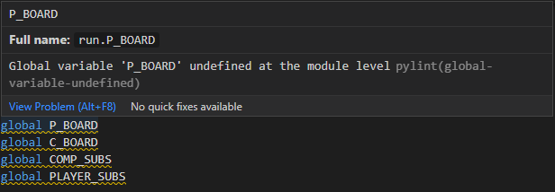

# S U B M A R I N E ██ D O M I N A T I O N 

```
█████████████████████████████████████████████████████████
███ T A C T I C A L █ M A R I N E █ E S P I O N A G E ███
█████████████████████████████████████████████████████████
████████ H I G H L Y █ A D V A N C E D ██ A I ███████████
█████████████████████████████████████████████████████████
██████████████ C O V E R T █ T E S T I N G ██████████████
█████████████████████████████████████████████████████████
███████████████ D O C U M E N T A T I O N ███████████████
█████████████████████████████████████████████████████████
```

# Testing

## Contents

1. [User Stories](#user-stories)
    - [User Stories: Answered](#user-stories-answered)
    - [User Goals: Achieved](#user-goals-achieved)
    - [Developer Goals: Achieved](#developer-goals-achieved)
2. [Manual Testing](#manual-testing)
 - [Index page](#index)
    - Responsiveness
    - Page load
    - Game Elements
3. [Automated Testing](#automated-testing)
 - [Lighthouse Testing](#lighthouse-testing)
 - [Code Validation](#code-validation)
   - Index page
     - HTML/CSS
     - Javascript
   - 404 page
     - HTML/CSS
   - 500 page
     - HTML/CSS
 - [Browser Validation](#browser-validation)
4. [User Testing](#user-testing)

# User Stories

## User Stories: Answered

### _"As a user, i want to play a simple game of battleships"_

- Submarine Domination; as a program, runs like a simplified version of battleships

### _"As a user, i want to play some kind of logic game"_

- The program takes information parsed by the user to discern what coordinates they are referring to on the player board - and - if that section has already been targeted (or a submarine sank at that point) the program will notify the user to pick a different set of coordinates before proceeding, thus demonstrating  the components fo a logic driven game/process

### _"As a user, i want to be able to position my own ships to allow for own personal strategy"_

- Upon selecting a New Game, the function for positioning the player's subs runs, where players can pick coordinates to set their own subs. These are reflected on the displayed game board

### _"As a user, i want to play against a 'computer' player"_

- The program houses multiple functions that simulate the effect of playing against a computer player 
- the `random` module allows for the program to generate random integers and compile them as coordinates (within the specified board ranges)

### _"As a user, i want to be able to make my own choices when trying to guess the position of enemy ships"_

- the user is presented with the same function to pick coordinates after placing their own subs. but is prompted this time round that it is for guessing computer coordinates. these values are parsed into a seperate set of functions to determine if the coordinates match any of that of the computer's chosen coordinates

### _"As a user, i want to be notified if i accidentally pick the same coordinate twice"_

- the function built to let users pick coordinates calls a seperate function each time it is run to check if a coordinate has been used before, prevents the process of the user's choice, cycles back to the input method for the user and generates a message to tell them why they cant pick a certain set of coordinates, depending on the reason.

### _"As a user, i want to be prompted if enter invalid coordinates"_ 

- see above

### _"As a user, i want to feel like my choices matter against the 'computer' player, and that i won't win if i just select each coordinate in sequential order"_

- The function that runs the computer's guesses contains a series of if statements that check against the number of turns that have occured in the game. At set intervals, the coputer will correctly guess 1 of the players coordinates. This can happen up to 5 times, and the game cannot cycle longer than 18 turns as a result.

<br>
<br>

## User Goals: Achieved

### create a command line game that is easy to follow

- game displays clear commands for the user to follow with clear prompting for information
- game rules and information are displayed through an option at the start fo the game which signposts all features and process of the game

### the UI must be readable and friendly within the given limitations

- The UI is indented to be centre aligned, and the use of coloured text and high contrast "blocking" of the board improves readability
- UI is simplistic in nature and freindly. does not punish users for bad choices or errors.

### Employ code that simulates players playing against a chellenging AI opponent

- A series of functions were created to simulate the turn of a computer player using `random` module and `if` statements
- AI presents as challenging as it will periodically guess players subs, and will not allow the game to go on longer than 18 turns at the very most

### Allow for elements of personal choice when positioning ships and targeting enemy ships

- Upon selecting a New Game, the function for positioning the player's subs runs, where players can pick coordinates to set their own subs. These are reflected on the displayed game board
- the user is presented with the same function to pick coordinates after placing their own subs. but is prompted this time round that it is for guessing computer coordinates. these values are parsed into a seperate set of functions to determine if the coordinates match any of that of the computer's chosen coordinates

### have contingencies in place if a mistake is made during an input error

-  functions that use input methods employ the use of `try`/`except`/`else` statements that predetermine actions program should take in the event of:
    - a value not matching the desired input type (string/integer)
    - the value not within the range of characters/numbers available for that choice
    - the input value being longer than a single character
    - the input value being less than a single character 
- This covers all eventualities of any potential incorrect input error

### not punish the user for not enetering EXACT coordinates information

- the program will not progress through iterations of any state until requirements of input fields are met, therefore, the computer will not "guess" enemy coordinates, nor will the game continue it the user makes an error. instead, the program will pause until correct input is entered

<br>
<br>

## Developer Goals: Achieved

### Have a command line game deployed and playable on the internet via Heroku©

- Command line game of `S U B M A R I N E ██ D O M I N A T I O N` has been deployed and is playable on Heroku: https://submarine-domination.herokuapp.com/

### Develop a version of the game _"Battleships"_ in the coding language: Python

- Game successfully built in Python
- Submarines are are just sports coupe hardtop boats 

### implement use of python libraries to enhance the UX of The terminal based game

- The following libraries were utilised to make the UX responsive, colorful and interactive:
    - [Random](https://docs.python.org/3/library/random.html) - To create random numbers
    - [OS](https://www.tutorialsteacher.com/python/os-module#:~:text=The%20OS%20module%20in%20Python,with%20the%20underlying%20operating%20system.) - to create a function that clears the terminal
    - [colorterm](https://pypi.org/project/colorterm/) - to color terminal print statements

### Make use of ASCII Art to add more of a visual element to the game

- [ascii.co.uk](https://ascii.co.uk/art/) Was referenced for the design of the winning and losing messages
- inspiration for the design of the game was drawn from the idea of "classified documents"
- the title itself was inspired by the original Metal Gear Solid title art form Playstation:


### create a program that only requires game narrative input from the user, no knowledge of working from a command line should be required to play the game.

- No python specific or command line commands are required to interact with the game. The user just simply has to follow the prompts on the screen

<br>
<br>

---

# Manual Testing

### _Note: For the purposes of testing, a "cheat sheet" variable is printed to the terminal each game turn to check comp coordinates and ensure everything works as planned. This is removed in the submitted version_

| Site responsiveness, load, and basic inputs|
| --------------------------- |
|When the page loads up, is refreshed, or when "run program" is clicked, the program runs with no issues|
|Inputs work with no issues, accepts upper and lower case values. raises error and delivers prompt for correct value upon incorrect value input. but does not cause code to break|
| Navigating to the instructions page, back to the main title and selecting a new game all work with no issues |
||

<br>

| Positioning subs function and exception handling |
| ------------------------------------------------ |
|Upon starting new game, player is presented inputs to enter coords to position their subs|
|Player can enter any valid coords as shown below|
|Invalid responses are met with custom input messages depening on what type of value is being entered|
|The board updates each time a new set of coordinates for a sub is entered|
|Once 5 subs have been placed on the board, the game begins|
||

<br>

| Input validation, exception handling during core gameplay loop and standard turn processes |
| --------------------------------------------------------------------------- |
| The same function for positioning player subs is used to select coordinates |
| Invalid values raise handled exceptions and prevent the program from breaking |
| game turns will not progress until valid inputs are entered |
| Exception will raise on - input value not matching type (string/integer), not matching predesignated choice criteria per selection ("ABCDEFGH"/"1234") |
| on inputs where a character is required, the input is not case-sensetive |
| correct guesses by the player are updated on the computer's board with "X". The terminal also prints a statement in green saying that the player hit a sub |
| Incorrect guesses by the player are marked on the computer's board with ".". The terminal will print a statement to say they missed the target|
|guesses by the computer are made after the player but displayed simoultaneously with each player turn|
|correct guesses by the computer replace the targeted player's "@" with "X". a Print statement in red is also displayed saying that the target at the given coordinates has been hit|
|Incorrect guesses by the computer are marked with "." on the player's board. the terminal prints a message to display what coords the computer targeted|
|  |

<br>

| Testing lose mechanics |
| ---------------------- |
|The computer will automatically win after 19 turns (max)|
|The computer guesses player ships at the relevant turns: `4`, `8`, `12`, `16`, `19`|
|The computer cannot pick the same coordinates twice|
|When all player subs are sunk, the terminal is cleared and the lose message is printed|
|Player can then enter y/n into the input field generated to start a new game or retur to the title field|
||

<br>

|Testing Win mechanics|
| ------------------- |
|same process as above is followed except following criteria is generated when player sinks all enemy subs|
|terminal is cleared and replaced with winning message and option to play a new game or return to title|
||

<br>
<br>

# Automated Testing

Lighthouse testing was omitted for this project, as web elements were outwith project scope.


## **Code Validation**

Code was managed and styled within [PEP8]() Guidelines thanks to the implementation of pylint linter which was imported into this project.

According to the linter, there are no major discrepancies in this code.

The only minor issue logged is the placement of Global variable which raises a minor warning:


However, these variables code not be placed at the top of the code, as this throws an error in the code, as well is producing the same warning.*

* Code has been crosschecked with a secondary linter `pycodestyle` and the warning has now diseppeared

Secondary linter also showing no errors.

<br>

## **Browser Validation**
Program was also tested on the following devices and browsers:

PC:
- Google Chrome
    - By Dev
    - By Tester/s
- Mozilla Firefox
    - By Dev
    - By Tester/s
- Opera
    - By Dev
- MS Edge
    - By Dev
- Safari
    - By Tester/s
- Google Chrome on Android
    - By Dev
- Safari on iOS
    - By Tester/s

The program worked optimally on all desktop settings. The program did run into position and sizing issues on Android devices, and the program could not be interacted with on handheld iOS devices. However, this was not in project scope and therefore not addressed.


